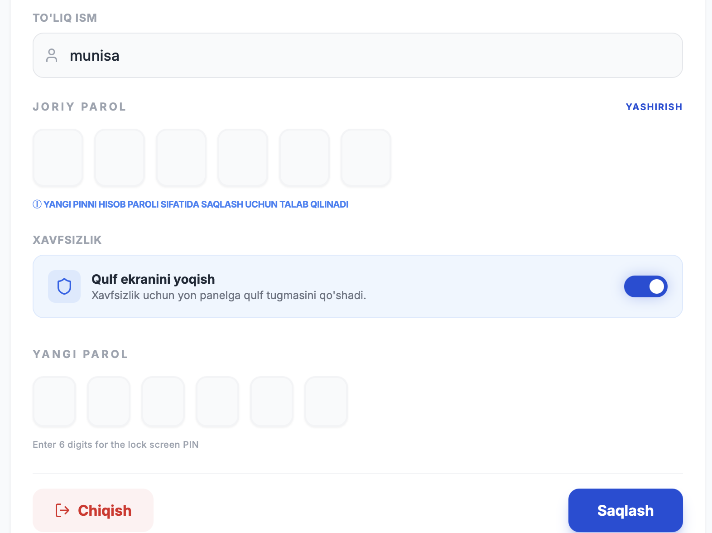

# Admin Panel Access Guide

## How to Access the Admin Panel

### Step 1: Navigate to Admin Login
1. Go to the `superadmin-platform` directory
2. Start the development server:
   ```bash
   cd superadmin-platform
   npm run dev
   ```
3. Open your browser and navigate to:
   ```
   http://localhost:3000/login
   ```

### Step 2: Login Credentials
- **Password**: `xurshida4941`
- Enter the password and click "Access Dashboard"

### Step 3: Admin Dashboard
After successful login, you will be redirected to:
```
http://localhost:3000/admin
```

## Admin Panel Features

### User Management
- **Create New User**: Click "Add User" button to create a new user account
- **Search Users**: Use the search bar to find users by phone number
- **Toggle User Status**: Enable/disable user accounts
- **Delete Users**: Remove user accounts from the system

### Account Isolation
- Each admin has their own `accountId` for multi-tenancy
- Users created by an admin are linked to that admin's account
- Users can only see and manage users in their own account

## Troubleshooting

### Cannot Create Account
If you're having issues creating accounts:
1. Check that you're logged in as admin
2. Ensure the `accountId` is properly set (it's stored in localStorage)
3. Check browser console for any errors
4. Verify Firebase connection is working

### Access Issues
- Make sure you're using the correct password
- Clear browser cache and localStorage if needed
- Check that the Next.js server is running on port 3000

